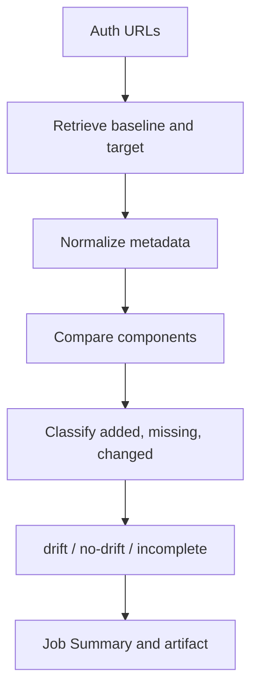

# Salesforce Metadata Drift Report

[](https://github.com/shivaprakashpokala/salesforce-metadata-drift-report/actions/workflows/ci.yml)

Compare two Salesforce orgs and publish a drift report.

Orgs drift when metadata is edited by hand, deployed manually, or changed outside CI — across production, staging, a support org, or a developer sandbox. Comparing Setup by hand does not show those metadata differences reliably. This action logs into both orgs with SFDX auth URLs, retrieves the same metadata, and reports what was added, what is missing, and what changed. Drift alone does not fail the job.

## Quick start

You need the Salesforce CLI on the runner (the workflow below installs it) and two repository secrets, each holding one org's SFDX auth URL.

Save this as `.github/workflows/metadata-drift.yml`:

```yaml
name: Metadata drift

on:
  workflow_dispatch:
  schedule:
    - cron: '0 6 * * 1'

permissions:
  contents: read

jobs:
  drift-report:
    runs-on: ubuntu-latest
    steps:
      - name: Install Salesforce CLI
        run: npm install --global @salesforce/cli

      - name: Compare production with QA
        id: drift
        uses: shivaprakashpokala/salesforce-metadata-drift-report@v1
        with:
          baseline-auth-url: ${{ secrets.SFDX_PROD_AUTH_URL }}
          target-auth-url: ${{ secrets.SFDX_QA_AUTH_URL }}

      - name: Fail on drift
        if: steps.drift.outputs.has-drift == 'true'
        run: exit 1
```

Leave out the last step if drift should only be reported. Copy-paste workflows are in the repo: [one org](examples/org-vs-sandbox.yml) and [several orgs against one baseline](examples/sandbox-matrix.yml).

GitHub-hosted runners can run this action. A self-hosted runner needs Node.js 24.

## What gets compared

Metadata components, not records and not Setup screens.

Default scope:

- **Types:** CustomObject, Layout, Flow, Profile, PermissionSet, FlexiPage, ApexClass, ApexTrigger, CustomApplication, RemoteSiteSetting
- **Custom objects:** every custom object, including its fields, validation rules, and record types
- **Standard objects:** Account, Contact, Lead, Opportunity, and Case, with their custom fields

Other types, such as ApexPage, CustomTab, LightningComponentBundle, NamedCredential, and StaticResource, work the same way when you add them to `metadata-types`. A type that cannot be retrieved with a wildcard needs a `package.xml`.

Left out unless you ask for them:

- Managed-package components. Wildcard retrieve skips them. List them in `package.xml` if you need them.
- Users, Chatter, reports, and any type you did not retrieve.
- Profile and permission set entries for objects, fields, classes, pages, tabs, apps, or record types that are not in the same scope.

If Salesforce cannot return part of the scope, or a retrieved file is not metadata, the outcome is **incomplete**. The report is still published, and the step fails.

## How drift is found



- **Retrieve** the same scope from both orgs, from `metadata-types` and `standard-objects`, or from your `package.xml`.
- **Normalize** XML so element order, whitespace, and sorted profile entries are not drift.
- **Compare** by type and name: added in the target, missing from the target, changed, or unchanged.
- **Outcome:** `drift` when something differs, `no-drift` when it matches, `incomplete` when part of the scope could not be retrieved or identified. A bad auth URL or a failed retrieve is `error`, with no report.

## Auth URL

```bash
sf org login web --alias prod
sf org auth show-sfdx-auth-url --target-org prod --json
```

Copy `result.sfdxAuthUrl` into a secret such as `SFDX_PROD_AUTH_URL`. For a sandbox, log in with `--instance-url https://test.salesforce.com`. Never commit an auth URL.

Use an integration user with **API Enabled**, **View Setup and Configuration**, and **Modify Metadata Through Metadata API Functions**. Retrieve needs that last permission even though this action does not deploy.

## What you get

- Artifact `salesforce-metadata-drift-report` with the report as Markdown, HTML, and JSON.
- Job Summary with the verdict, added, missing, and changed components, and a line diff for Apex. It shows each org's username and Org ID.
- Outputs: `comparison-status` (`drift`, `no-drift`, `incomplete`, or `error`), `has-drift`, `added-count`, `removed-count`, `changed-count`, `unchanged-count`, the three report paths, and `artifact-id`.

Removed means present in the baseline and missing from the target.

## Optional inputs

The quick start uses the defaults. Every input below is still supported.

| Input | Default | Description |
|---|---|---|
| `metadata-types` | CustomObject, Layout, Flow, Profile, PermissionSet, FlexiPage, ApexClass, ApexTrigger, CustomApplication, RemoteSiteSetting | Types to compare. Fields, validation rules, and record types come with CustomObject. |
| `standard-objects` | Account, Contact, Lead, Opportunity, Case | Standard objects to include with CustomObject. |
| `package-xml-path` | | Your `package.xml`, used instead of the two inputs above. Check out the repository first so the file is on the runner. |
| `api-version` | latest version both orgs support | For example `64.0`. |
| `baseline-label`, `target-label` | org name | Names shown in the report. |
| `artifact-name` | `salesforce-metadata-drift-report` | Must be unique within a workflow run. |
| `artifact-retention-days` | `14` | Days to keep the artifact. |
| `upload-artifact`, `job-summary` | `true` | Turn the artifact or Job Summary off. |
| `output-dir` | `drift-report` | Folder for the report files on the runner. |
| `working-dir` | `.sf-drift-work` | Scratch folder for the retrieve. Removed after the run. |

## License

[MIT](LICENSE)
